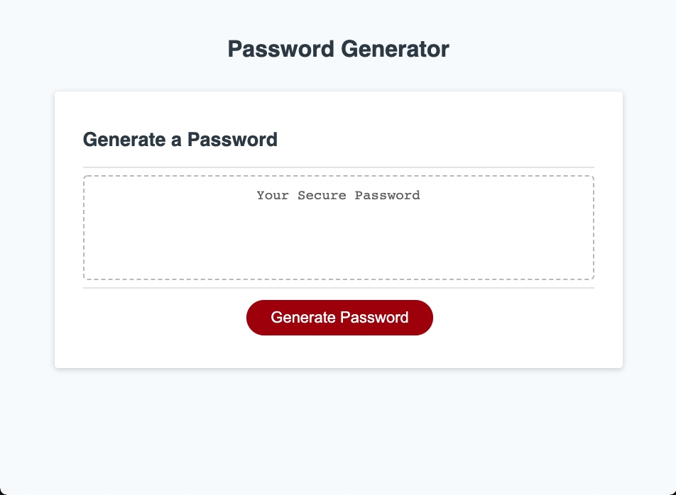

# 03 JavaScript: Password Generator

## My Task

This week’s homework requires me to modify starter code to create an application that enables employees to generate random passwords based on criteria that they’ve selected. This app will run in the browser and will feature dynamically updated HTML and CSS powered by JavaScript code that I have writen. It will have a clean and polished, responsive user interface that adapts to multiple screen sizes.

## User Story

```
AS AN employee with access to sensitive data
I WANT to randomly generate a password that meets certain criteria
SO THAT I can create a strong password that provides greater security
```

## Acceptance Criteria

```
GIVEN I need a new, secure password
WHEN I click the button to generate a password
THEN I am presented with a series of prompts for password criteria
WHEN prompted for password criteria
THEN I select which criteria to include in the password
WHEN prompted for the length of the password
THEN I choose a length of at least 8 characters and no more than 128 characters
WHEN asked for character types to include in the password
THEN I confirm whether or not to include lowercase, uppercase, numeric, and/or special characters
WHEN I answer each prompt
THEN my input should be validated and at least one character type should be selected
WHEN all prompts are answered
THEN a password is generated that matches the selected criteria
WHEN the password is generated
THEN the password is either displayed in an alert or written to the page
```
<a href="https://crumwj22.github.io/password-generator/">Password Generator</a>



# Code I could not get to work

// Assignment Code
var generateBtn = document.querySelector("#generate");

// Write password to the #password input
function writePassword() {
  var password = generatePassword();
  var passwordText = document.querySelector("#password");

  passwordText.value = password;
}

// Add event listener to generate button
generateBtn.addEventListener("click", writePassword);

// buckets for each character type 
var enter;
var confirmNumber;
var confirmCharacter;
var confirmUppercase;
var confirmLowercase;

// Start Password variable values: 

// Numeric characters
var number = [0, 1, 2, 3, 4, 5, 6, 7, 8, 9];

// Special characters 
var character = ["!", "#", "$", "%", "&", "'", "(", ")", "*", "+", ",", "-", ".", "/", "<", "=", ">", "?", "@", "[", "]", "^", "_", "`", "{", "|", "}", "~"];

// Alphabetical characters
var lowerCase = ["a", "b", "c", "d", "e", "f", "g", "h", "i", "j", "k", "l", "m", "n", "o", "p", "q", "r", "s", "t", "u", "v", "w", "x", "y", "z"];
// Space is for the Uppercase conversion

var upperCase = ["A", "B", "C", "D", "E", "F", "G", "H", "I", "J", "K", "L", "M", "N", "O", "P", "Q", "R", "S", "T", "U", "V", "W", "X", "Y", "Z"];
// Choices declared outside the if statement so they can be concatenated upon condition

var choices = [];
var garNum = [];


function generatePassword() {

    
    
    enter = parseInt(prompt("How many characters would you like your password to be? Choose between 8 and 128"));
    // First if statement for user validation 
    if (!enter) {
        alert("Please enter a value");
    } else if (enter < 8 || enter > 128) {
        // Validates user input
        alert("You must choose between 8 and 128")

        return"Try again";

    // Start user input prompts    
    } else {
        
        confirmNumber = confirm("Will your password contain numbers?");
        confirmCharacter = confirm("Will your password contain special characters?");
        confirmUppercase = confirm("Will your password contain Uppercase letters?");
        confirmLowercase = confirm("Will your password contain Lowercase letters?");
    }

    // if for 4 negative options
    if (!confirmCharacter && !confirmNumber && !confirmUppercase && !confirmLowercase) {
        choices = alert("You must choose a criteria!");
    }
    
    // if Number selected
    if (confirmNumber) {
        choices = choices.concat(number);
        var ranIndex = Math.floor(Math.random() * number.length);
        var possibleNum = number[ranIndex] 
        garNum.push(possibleNum)
    }


    // if Character selected
    if (confirmCharacter) {
        choices = choices.concat(character);
        var ranIndex = Math.floor(Math.random() * character.length);
        var possibleChar = character[ranIndex] 
        garNum.push(possibleChar)
    }


    // if Uppercase selected
    if (confirmUppercase) {
        choices = choices.concat(upperCase);
        var ranIndex = Math.floor(Math.random() * upperCase.length);
        var possibleUppercase = upperCase[ranIndex] 
        garNum.push(possibleUppercase)
    }

    // if Lowercase selected
    if (confirmLowercase) {
        choices = choices.concat(lowerCase);
        var ranIndex = Math.floor(Math.random() * lowerCase.length);
        var possibleLowercase = lowerCase[ranIndex] 
        garNum.push(possibleLowercase)
    }
    
    // password variable is an array placeholder for user generated amount of length
    var password = [];

    // Start random selection variables:
    // Random selection for all variables: 
    for (var i = 0; i == parseInt(garNum); i++) {
        var pickChoices = choices[Math.floor(Math.random() * choices.length)];
        password.push(garNum[pickChoices]);
    }

    for (var i = 0; i < parseInt(garNum); i++) {
        password [i] = garNum [i]
    }
    
    
    return password.join("");
}
